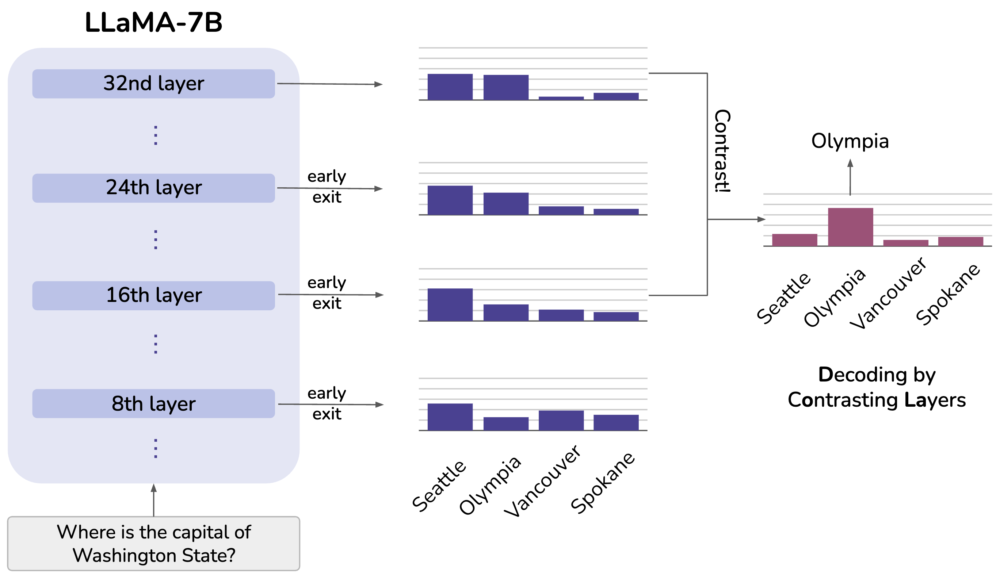

DoLa: Decoding by Contrasting Layers Improves Factuality in Large Language Models
===

[](https://opensource.org/licenses/MIT)
[](https://arxiv.org/abs/2309.03883)
[](https://github.com/huggingface/transformers)
[](https://twitter.com/YungSungChuang/status/1701623359153316255)
[](https://github.com/voidism/DoLa/stargazers)

[](https://colab.research.google.com/github/voidism/DoLa/blob/master/dola_evaluation.ipynb)

Code for the paper "DoLa: Decoding by Contrasting Layers Improves Factuality in Large Language Models"

Paper: https://arxiv.org/abs/2309.03883  
Authors: [Yung-Sung Chuang](https://people.csail.mit.edu/yungsung/) $^\dagger$, [Yujia Xie](https://sites.google.com/view/yujia) $^\ddagger$, [Hongyin Luo](https://luohongyin.github.io/) $^\dagger$, [Yoon Kim](https://people.csail.mit.edu/yoonkim/) $^\dagger$, [James Glass](https://people.csail.mit.edu/jrg/) $^\dagger$, [Pengcheng He](https://scholar.google.com/citations?user=TS1RoxAAAAAJ&hl=en) $^\ddagger$  
$^\dagger$ Massachusetts Institute of Technology, $^\ddagger$ Microsoft

## Overview



Despite their impressive capabilities, large language models (LLMs) are prone to hallucinations, i.e., generating content that deviates from  facts seen during pretraining. We propose a simple decoding strategy for reducing hallucinations with pretrained LLMs that does not require conditioning on retrieved external knowledge nor additional fine-tuning. Our approach obtains the next-token distribution by contrasting the differences in logits obtained from projecting the later layers versus earlier layers to the vocabulary space, exploiting the fact that factual knowledge in an LLMs has generally been shown to be localized to particular transformer layers. We find that this **D**ecoding by c**o**ntrasting **La**yers (DoLA) approach is able to better surface factual knowledge and reduce the generation of incorrect facts.  DoLA consistently improves the truthfulness across multiple choices tasks and open-ended generation tasks, for example improving performance of LLaMA family models on TruthfulQA by 12-17\% absolute points, demonstrating its potential in making LLMs reliably generate truthful facts.

## Setup

```
pip install -e transformers-4.28.1
pip install datasets
pip install accelerate
pip install openai # -> only for truthfulqa and gpt4_eval
```

## Experiments

### Arguments

| Argument          | Example           | Description   |
| ----------------- | ----------------- | ------------- |
| `--model-name`    | `huggyllama/llama-7b` | Specifies the model you want to use, currently we only support LLaMA-v1. |
| `--data-path`     | `/path/to/dataset` | Path to the dataset file or folder. |
| `--output-path`   | `output-path.json` | Where to store the output results. |
| `--num-gpus`      | `1` | Number of GPUs to use, `1/2/4/8` for `7B/13B/30B/65B` model sizes respectively.  |
| `--max_gpu_memory`| `27` | Maximum GPU memory size (in GiB) to allocate. Default: 27 (for 32G V100).  |

### Understanding `--early-exit-layers`

The `--early-exit-layers` argument takes a string containing a sequence of layer numbers separated by commas, with no spaces in between. By specifying different number of layers, we make the model decode at different modes.


| Number of Layers Specified  | Example (str)     | Description of Decoding Mode                                                                                     |
| ---------------------------| ------------- | ----------------------------------------------------------------------------------------------- |
| 1                          | `-1`      | **Naive decoding** from the final layer output.       |
| 2                          | `16,32`   | **DoLa-static decoding** with the second specified layer (i.e. `32`) as the `mature_layer` and first specified layer (i.e. `16`) as `premature_layer`. |
| >2                         | `0,2,4,6,8,10,12,14,32`    | **DoLa decoding** with the last specified layer (i.e. `32`) as the `mature_layer` and all the preceding layers (i.e. `0,2,4,6,8,10,12,14`) as `candidate_premature_layers`. |

### FACTOR (Multiple Choices)
Please download the data file `wiki_factor.csv` from https://github.com/AI21Labs/factor

#### Baseline
```bash
python factor_eval.py --model-name huggyllama/llama-7b --data-path /path/to/wiki_factor.csv --output-path output-path.json --num-gpus 1
python factor_eval.py --model-name huggyllama/llama-13b --data-path /path/to/wiki_factor.csv --output-path output-path.json --num-gpus 2
python factor_eval.py --model-name huggyllama/llama-30b --data-path /path/to/wiki_factor.csv --output-path output-path.json --num-gpus 4
python factor_eval.py --model-name huggyllama/llama-65b --data-path /path/to/wiki_factor.csv --output-path output-path.json --num-gpus 8
```

#### DoLa
```bash
python factor_eval.py --model-name huggyllama/llama-7b --early-exit-layers 0,2,4,6,8,10,12,14,32 --data-path /path/to/wiki_factor.csv --output-path output-path.json --num-gpus 1
python factor_eval.py --model-name huggyllama/llama-13b --early-exit-layers 0,2,4,6,8,10,12,14,16,18,40 --data-path /path/to/wiki_factor.csv --output-path output-path.json --num-gpus 2
python factor_eval.py --model-name huggyllama/llama-30b --early-exit-layers 0,2,4,6,8,10,12,14,16,18,60 --data-path /path/to/wiki_factor.csv --output-path output-path.json --num-gpus 4
python factor_eval.py --model-name huggyllama/llama-65b --early-exit-layers 0,2,4,6,8,10,12,14,16,18,80 --data-path /path/to/wiki_factor.csv --output-path output-path.json --num-gpus 8
```

### TruthfulQA (Multiple Choices)

The `--data-path` should be a folder contains `TruthfulQA.csv`. If file not exists, it will be downloaded automatcially.

#### Baseline
```bash
python tfqa_mc_eval.py --model-name huggyllama/llama-7b --data-path /path/to/data/folder --output-path output-path.json --num-gpus 1
python tfqa_mc_eval.py --model-name huggyllama/llama-13b --data-path /path/to/data/folder --output-path output-path.json --num-gpus 2
python tfqa_mc_eval.py --model-name huggyllama/llama-30b --data-path /path/to/data/folder --output-path output-path.json --num-gpus 4
python tfqa_mc_eval.py --model-name huggyllama/llama-65b --data-path /path/to/data/folder --output-path output-path.json --num-gpus 8
```

#### DoLa
```bash
python tfqa_mc_eval.py --model-name huggyllama/llama-7b --early-exit-layers 16,18,20,22,24,26,28,30,32 --data-path /path/to/data/folder --output-path output-path.json --num-gpus 1
python tfqa_mc_eval.py --model-name huggyllama/llama-13b --early-exit-layers 20,22,24,26,28,30,32,34,36,38,40 --data-path /path/to/data/folder --output-path output-path.json --num-gpus 2
python tfqa_mc_eval.py --model-name huggyllama/llama-30b --early-exit-layers 40,42,44,46,48,50,52,54,56,58,60 --data-path /path/to/data/folder --output-path output-path.json --num-gpus 4
python tfqa_mc_eval.py --model-name huggyllama/llama-65b --early-exit-layers 60,62,64,66,68,70,72,74,76,78,80 --data-path /path/to/data/folder --output-path output-path.json --num-gpus 8
```

### TruthfulQA

To evaluate the open-ended generation result of TruthfulQA, we need to finetune two GPT-3 curie models through OpenAI API:

```
openai api fine_tunes.create -t finetune_truth.jsonl -m curie --n_epochs 5 --batch_size 21 --learning_rate_multiplier 0.1
openai api fine_tunes.create -t finetune_info.jsonl -m curie --n_epochs 5 --batch_size 21 --learning_rate_multiplier 0.1
```

After finetuning, we can obtain the finetuned model names by `openai api fine_tunes.list | grep fine_tuned_model`.

Create a config file `gpt3.config.json` like this:

```json
{"gpt_info": "curie:ft-xxxxxxxxxx",
"gpt_truth": "curie:ft-xxxxxxxxxx",
"api_key": "xxxxxxx"}
```

Add the argument `--do-rating --gpt3-config gpt3.config.json` for GPT-3 evaluation.

#### Baseline
```bash
python tfqa_eval.py --model-name huggyllama/llama-7b --data-path /path/to/data/folder --output-path output-path.json --num-gpus 1 --do-rating --gpt3-config /path/to/gpt3.config.json
python tfqa_eval.py --model-name huggyllama/llama-13b --data-path /path/to/data/folder --output-path output-path.json --num-gpus 2 --do-rating --gpt3-config /path/to/gpt3.config.json
python tfqa_eval.py --model-name huggyllama/llama-30b --data-path /path/to/data/folder --output-path output-path.json --num-gpus 4 --do-rating --gpt3-config /path/to/gpt3.config.json
python tfqa_eval.py --model-name huggyllama/llama-65b --data-path /path/to/data/folder --output-path output-path.json --num-gpus 8 --do-rating --gpt3-config /path/to/gpt3.config.json
```

#### DoLa
```bash
python tfqa_eval.py --model-name huggyllama/llama-7b --early-exit-layers 16,18,20,22,24,26,28,30,32 --data-path /path/to/data/folder --output-path output-path.json --num-gpus 1 --do-rating --gpt3-config /path/to/gpt3.config.json
python tfqa_eval.py --model-name huggyllama/llama-13b --early-exit-layers 20,22,24,26,28,30,32,34,36,38,40 --data-path /path/to/data/folder --output-path output-path.json --num-gpus 2 --do-rating --gpt3-config /path/to/gpt3.config.json
python tfqa_eval.py --model-name huggyllama/llama-30b --early-exit-layers 40,42,44,46,48,50,52,54,56,58,60 --data-path /path/to/data/folder --output-path output-path.json --num-gpus 4 --do-rating --gpt3-config /path/to/gpt3.config.json
python tfqa_eval.py --model-name huggyllama/llama-65b --early-exit-layers 60,62,64,66,68,70,72,74,76,78,80 --data-path /path/to/data/folder --output-path output-path.json --num-gpus 8 --do-rating --gpt3-config /path/to/gpt3.config.json
```

### GSM8K

We use a random sampled subset of GSM8K training set to serve as the validation set of both StrategyQA and GSM8K. The file can be downloaded [here](https://www.dropbox.com/scl/fi/o8zde51x0erejbp8bo8d5/gsm8k-train-sub.jsonl?rlkey=yu90sjt58fk1cell3ey4v8xuu&dl=0).

The `--data-path` argument should be either:
- A folder that contains `gsm8k_test.jsonl`, otherwise the files will be downloaded automatically to the folder you specified. 
- (Only for GSM8K) The path to `gsm8k-train-sub.jsonl` which can be downloaded by the link above.

#### Baseline
```bash
python gsm8k_eval.py --model-name huggyllama/llama-7b --data-path /path/to/data/folder --output-path output-path.json --num-gpus 1
python gsm8k_eval.py --model-name huggyllama/llama-13b --data-path /path/to/data/folder --output-path output-path.json --num-gpus 2
python gsm8k_eval.py --model-name huggyllama/llama-30b --data-path /path/to/data/folder --output-path output-path.json --num-gpus 4
python gsm8k_eval.py --model-name huggyllama/llama-65b --data-path /path/to/data/folder --output-path output-path.json --num-gpus 8
```

#### DoLa
```bash
python gsm8k_eval.py --model-name huggyllama/llama-7b --early-exit-layers 0,2,4,6,8,10,12,14,32 --data-path /path/to/data/folder --output-path output-path.json --num-gpus 1
python gsm8k_eval.py --model-name huggyllama/llama-13b --early-exit-layers 0,2,4,6,8,10,12,14,16,18,40 --data-path /path/to/data/folder --output-path output-path.json --num-gpus 2
python gsm8k_eval.py --model-name huggyllama/llama-30b --early-exit-layers 0,2,4,6,8,10,12,14,16,18,60 --data-path /path/to/data/folder --output-path output-path.json --num-gpus 4
python gsm8k_eval.py --model-name huggyllama/llama-65b --early-exit-layers 0,2,4,6,8,10,12,14,16,18,80 --data-path /path/to/data/folder --output-path output-path.json --num-gpus 8
```

### StrategyQA

The `--data-path` argument should be a folder that contains `strategyqa_train.json`, otherwise the files will be downloaded automatically to the folder you specified.

#### Baseline
```bash
python strqa_eval.py --model-name huggyllama/llama-7b --data-path /path/to/data/folder --output-path output-path.json --num-gpus 1
python strqa_eval.py --model-name huggyllama/llama-13b --data-path /path/to/data/folder --output-path output-path.json --num-gpus 2
python strqa_eval.py --model-name huggyllama/llama-30b --data-path /path/to/data/folder --output-path output-path.json --num-gpus 4
python strqa_eval.py --model-name huggyllama/llama-65b --data-path /path/to/data/folder --output-path output-path.json --num-gpus 8
```

#### DoLa
```bash
python strqa_eval.py --model-name huggyllama/llama-7b --early-exit-layers 0,2,4,6,8,10,12,14,32 --data-path /path/to/data/folder --output-path output-path.json --num-gpus 1
python strqa_eval.py --model-name huggyllama/llama-13b --early-exit-layers 0,2,4,6,8,10,12,14,16,18,40 --data-path /path/to/data/folder --output-path output-path.json --num-gpus 2
python strqa_eval.py --model-name huggyllama/llama-30b --early-exit-layers 0,2,4,6,8,10,12,14,16,18,60 --data-path /path/to/data/folder --output-path output-path.json --num-gpus 4
python strqa_eval.py --model-name huggyllama/llama-65b --early-exit-layers 0,2,4,6,8,10,12,14,16,18,80 --data-path /path/to/data/folder --output-path output-path.json --num-gpus 8
```

### GPT-4 Evaluation (Vicuna QA Benchmark)

In GPT-4 evaluation, we need the question file from [FastChat](https://github.com/lm-sys/FastChat). In the following commands, we assume the path to your FastChat repo is `$fastchat`.

#### Baseline
```bash
python gpt4_judge_eval.py --model-name huggyllama/llama-7b --model-id llama-7b-baseline --question-file $fastchat/eval/table/question.jsonl --answer-file output-answer.jsonl --num-gpus 1
python gpt4_judge_eval.py --model-name huggyllama/llama-13b --model-id llama-13b-baseline --question-file $fastchat/eval/table/question.jsonl --answer-file output-answer.jsonl --num-gpus 2
python gpt4_judge_eval.py --model-name huggyllama/llama-30b --model-id llama-30b-baseline --question-file $fastchat/eval/table/question.jsonl --answer-file output-answer.jsonl --num-gpus 4
python gpt4_judge_eval.py --model-name huggyllama/llama-65b --model-id llama-65b-baseline --question-file $fastchat/eval/table/question.jsonl --answer-file output-answer.jsonl --num-gpus 8
```

#### DoLa
```bash
python gpt4_judge_eval.py --model-name huggyllama/llama-7b --early-exit-layers 0,2,4,6,8,10,12,14,32 --model-id llama-7b-dola --question-file $fastchat/eval/table/question.jsonl --answer-file output-answer.jsonl --num-gpus 1
python gpt4_judge_eval.py --model-name huggyllama/llama-13b --early-exit-layers 0,2,4,6,8,10,12,14,16,18,40 --model-id llama-13b-dola --question-file $fastchat/eval/table/question.jsonl --answer-file output-answer.jsonl --num-gpus 2
python gpt4_judge_eval.py --model-name huggyllama/llama-30b --early-exit-layers 0,2,4,6,8,10,12,14,16,18,60 --model-id llama-30b-dola --question-file $fastchat/eval/table/question.jsonl --answer-file output-answer.jsonl --num-gpus 4
python gpt4_judge_eval.py --model-name huggyllama/llama-65b --early-exit-layers 0,2,4,6,8,10,12,14,16,18,80 --model-id llama-65b-dola --question-file $fastchat/eval/table/question.jsonl --answer-file output-answer.jsonl --num-gpus 8
```

After running the above commands to generate the model responses, we need OpenAI API key to pairwise compare the responses from different decoding results.

```bash
python $fastchat/eval/eval_gpt_review.py -q $fastchat/eval/table/question.jsonl -a output-answer-1.jsonl output-answer-2.jsonl -p $fastchat/eval/table/prompt.jsonl -r $fastchat/eval/table/reviewer.jsonl -o output-review-path.jsonl -k openai_api_key
```

For more details of GPT-4 evaluation, please check [vicuna-blog-eval](https://github.com/lm-sys/vicuna-blog-eval/tree/main/eval).

## Reference Repositories
- FastChat: https://github.com/lm-sys/FastChat
- ContrastiveDecoding: https://github.com/XiangLi1999/ContrastiveDecoding
- TruthfulQA: https://github.com/sylinrl/TruthfulQA
- zero_shot_cot: https://github.com/kojima-takeshi188/zero_shot_cot
- FederatedScope: https://github.com/alibaba/FederatedScope

## Citation

[](https://doi.org/10.48550/arXiv.2309.03883)

Please cite our paper if it's helpful to your work!
```
@article{chuang2023dola,
  title={DoLa: Decoding by Contrasting Layers Improves Factuality in Large Language Models},
  author={Chuang, Yung-Sung and Xie, Yujia and Luo, Hongyin and Kim, Yoon and Glass, James and He, Pengcheng},
  journal={arXiv preprint arXiv:2309.03883},
  year={2023},
}
```